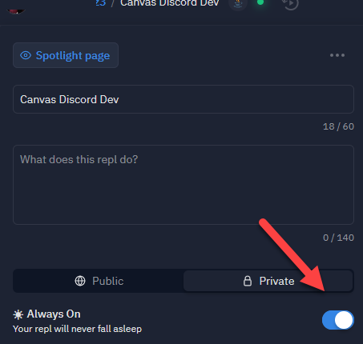

# CanvasBot

A Discord Bot that reminds users an hour before for upcoming assignments. 
*still in the works...*

Only functions for one server, as of now.
## Getting Started
1. `git clone https://github.com/JosChavz/CanvasBot.git`
1. Rename `example_keys.ini` to `keys.ini` in *src/main/resources*
1. Input your discord's bot Token next to `discord_keys` in *keys.ini*
   1. [How to get Discord Token](https://www.writebots.com/discord-bot-token/)
1. Input your Canvas API token next to `canvas_keys` in *keys.ini*
   1. [How to get API Keys](https://community.canvaslms.com/t5/Student-Guide/How-do-I-manage-API-access-tokens-as-a-student/ta-p/273)
1. Add your **school** URL looking alike `url`, replacing `[school]` in *keys.ini*, plus add the Course ID replacing `[course ID]`
   1. ex: `url=https://miracosta.instructure.com/api/v1/courses/12345/assignments`

#### Want to host it using Repl.it?
1. Create a new private repl
1. Under shell, write
   1. `git init`
   1. `git add remote origin https://github.com/JosChavz/CanvasBot.git`
   1. `git fetch --all`
   1. `git pull origin master`
1. In the Main class that repl sets up by default, write
   1. `DiscordMain.main(args);`
      which will run the actual main.
1. Start from #2 from Getting Started 🔼
1. Make sure that the *Always on*, is on! 
1. Run it.

#### Resources
[Zone ID Java Docs](https://docs.oracle.com/javase/8/docs/api/java/time/ZoneId.html)

##### Prior Logs
https://github.com/discord-canvas-api/CanvasAPI
